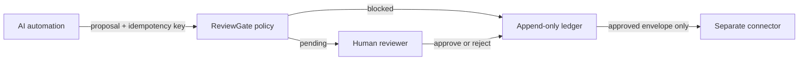

# ReviewGate

[](https://github.com/kanuwrld/reviewgate/actions/workflows/ci.yml)
[](LICENSE)

A deny-by-default approval gateway for actions proposed by AI automations.

ReviewGate accepts an action proposal, evaluates a local policy, records an
append-only audit event, and keeps medium/high-risk work pending until a named
human approves or rejects it. Approved proposals can be exported as action
envelopes for a separate connector.

ReviewGate intentionally does **not** send email, move money, modify CRM records,
or call third-party APIs. Keeping execution outside the approval service makes
the trust boundary visible and testable.

## Controls

- Unknown actions are blocked.
- Target globs create explicit allowlists.
- High-risk actions cannot be configured for auto-approval.
- Secret-like payload keys are rejected before entering the ledger.
- Idempotency keys prevent duplicate proposals and conflicting reuse.
- Decisions append new events; previous events are never rewritten.
- Only approved proposals produce connector-ready envelopes.

## Quick start

Requirements: Node.js 22+.

```bash
npm ci
npm run build

node dist/src/cli.js propose \
  --policy examples/policy.json \
  --ledger .data/events.jsonl \
  --action support.reply.draft \
  --target ticket:DEMO-1042 \
  --payload examples/draft-proposal.json \
  --idempotency-key demo-1042-v1 \
  --requested-by support-triage
```

The response includes a stable proposal ID and `pending` status. Review it, then:

```bash
node dist/src/cli.js decide rg_REPLACE_ME \
  --ledger .data/events.jsonl \
  --approve \
  --actor reviewer@example.invalid \
  --note "Fictional demo checked"

node dist/src/cli.js export rg_REPLACE_ME \
  --ledger .data/events.jsonl \
  --output .data/approved-action.json
```

## HTTP service

```bash
node dist/src/cli.js serve \
  --policy examples/policy.json \
  --ledger .data/events.jsonl
```

Endpoints:

- `GET /health`
- `POST /v1/proposals`
- `GET /v1/proposals?status=pending`
- `GET /v1/proposals/:id`
- `POST /v1/proposals/:id/decisions`
- `GET /v1/proposals/:id/export`

The service binds to `127.0.0.1` by default and has no authentication layer.
Do not expose it to a network as-is. Place production authentication,
authorization, TLS, request signing, rate limits, and durable storage in front
of this reference implementation.

## Policy example

```json
{
  "version": 1,
  "actions": {
    "support.reply.draft": {
      "risk": "medium",
      "mode": "approval_required",
      "allowedTargets": ["ticket:*"],
      "maxPayloadBytes": 16384
    },
    "payment.refund": {
      "risk": "high",
      "mode": "block"
    }
  }
}
```

## Architecture



The JSONL ledger is intentionally simple for review and tests. It is not a
multi-node production database. Back it up, restrict file permissions, and avoid
placing personal data or secrets in proposals.

## Development

```bash
npm test
npm run check
```

## Roadmap

- [ ] Signed connector envelopes with short expirations
- [ ] PostgreSQL event-store adapter and reviewer RBAC
- [ ] Web UI for side-by-side payload review
- [ ] Webhook callbacks for decision events

## License

MIT. See [LICENSE](LICENSE).
